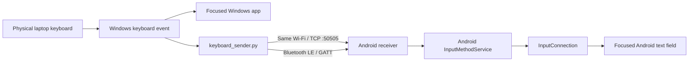

# ⌨️ Laptop Keyboard Bridge

> Use your **Windows laptop keyboard** to type on an **Android phone** over **the same Wi-Fi** or **Bluetooth Low Energy**, without needing a separate physical keyboard.


---

## ✨ What it does

Laptop Keyboard Bridge mirrors your physical Windows keyboard to the currently focused text field on Android.

- 🌐 **Same-Wi-Fi mode:** fast local TCP connection
- 🔵 **Bluetooth mode:** BLE GATT connection
- ⚡ **F8:** instantly toggle phone forwarding ON/OFF
- ↵ **Enter:** normal Enter key
- ⇧↵ **Shift+Enter:** Shift-modified Enter, commonly used for a new line
- 🛑 **Esc:** disconnect and exit
- 🖥️ **Laptop typing remains normal:** Windows keystrokes are not suppressed
- 📱 Works through Android's standard `InputMethodService` / `InputConnection`

No cloud server is required.

---

## 🧠 How it works



The Windows listener **observes** the keyboard event; it does not suppress the original event. That means your laptop continues to receive the key normally while the bridge optionally mirrors it to Android.

---

## 🎛️ Controls

| Key | Action |
|---|---|
| `F8` | Toggle phone forwarding ON/OFF |
| `Enter` | Send normal Enter |
| `Shift + Enter` | Send Shift+Enter, typically a new line in supported editors |
| `Esc` | Disconnect and close the bridge |

### Laptop-only mode

You do **not** need to close the program just to stop typing on the phone.

Press:

```text
F8
```

The console will show:

```text
[Phone forwarding: OFF]
Laptop-only mode. Press F8 to resume phone forwarding.
```

Press `F8` again to resume mirroring.

---

# 🚀 Installation

## 1. Install the Android APK

This repository includes a GitHub Actions workflow, so **Android Studio is not required**.

1. Upload this project to a GitHub repository.
2. Open **Actions**.
3. Select **Build Android APK**.
4. Click **Run workflow**.
5. Wait for the workflow to finish.
6. Download the artifact named:

```text
LaptopKeyboardBridge-APK
```

7. Extract it.
8. Install `LaptopKeyboardBridge.apk` on your Android phone.

If Android asks for permission to install an app from that source, allow it only if you trust the APK you built.

---

## 2. Enable the Android keyboard

Open **Laptop Keyboard Bridge** on Android.

Tap:

1. **Enable Keyboard**
2. Enable **Laptop Keyboard Bridge**
3. Return to the app
4. Tap **Select Keyboard**
5. Select **Laptop Keyboard Bridge**

The receiver runs while this Android input method is active.

---

## 3. Prepare Windows

Install Python 3.

Open Command Prompt inside the `windows` folder:

```bash
pip install -r requirements.txt
```

Then launch:

```bash
python keyboard_sender.py
```

Or double-click:

```text
run.bat
```

---

# 🌐 Same-Wi-Fi mode

Connect the phone and laptop to the **same local Wi-Fi network**.

The Android app shows an address similar to:

```text
Wi-Fi IP: 192.168.1.42
Port: 50505
```

Run the Windows sender and choose:

```text
1. Same Wi-Fi
```

Enter the phone IP.

Once connected:

1. Open WhatsApp, Notes, Chrome, or another Android app.
2. Tap a text field.
3. Type on the laptop.
4. Use `F8` whenever you want laptop-only typing.

> Some guest Wi-Fi networks use client isolation and prevent devices on the same Wi-Fi from talking to each other.

---

# 🔵 Bluetooth mode

1. Turn Bluetooth on for both devices.
2. Give the Android app its requested Bluetooth permissions.
3. Select **Laptop Keyboard Bridge** as the Android keyboard.
4. Run the Windows sender.
5. Choose:

```text
2. Bluetooth
```

Windows scans for the BLE service automatically.

---

# ↵ Enter vs Shift+Enter

The bridge deliberately keeps these as different keyboard events.

```text
Enter
  └─> K:ENTER
      └─> Android KEYCODE_ENTER

Shift + Enter
  └─> K:SHIFT_ENTER
      └─> Android KEYCODE_ENTER + META_SHIFT_ON
```

This is more faithful than simply inserting a newline character because web editors and chat applications can decide what **Enter** and **Shift+Enter** mean.

Examples may include:

- `Enter` → submit/send
- `Shift+Enter` → insert a line break

Actual behavior still depends on the Android app or web editor receiving the event.

---

# 🔬 Event model

## Windows

```text
Physical keyboard
      ↓
Windows input stack
      ↓
Keyboard event
   ↙       ↘
Focused     pynput listener
Windows          ↓
application   Bridge transport
                  ↓
                Phone
```

The bridge does **not** turn the Windows keyboard into a virtual HID device and does **not** remove the local event.

## Android

```text
Wi-Fi/BLE command
      ↓
KeyboardBridgeService
      ↓
Android InputMethodService
      ↓
InputConnection
      ↓
Focused text editor / WebView / browser field
```

Printable text is committed through the Android input connection. Special keys are delivered as Android key events.

---

# 🛡️ Security

### Wi-Fi mode

The current Wi-Fi transport is intended for a **trusted private LAN**.

It listens on:

```text
TCP 50505
```

The current MVP does not provide end-to-end encryption or strong peer authentication.

Do **not**:

- expose port `50505` to the public internet
- port-forward it on your router
- use it on an untrusted public network for sensitive typing

Future security improvements can include authenticated pairing and encrypted transport.

### Bluetooth

Bluetooth LE reduces the need for a shared Wi-Fi network, but application-level authentication is still a useful future improvement.

---

# 🔒 Lockdown browsers and proctored environments

This project is a general keyboard/accessibility/productivity bridge. It is **not designed to bypass secure browsers, proctoring controls, application restrictions, or organizational security policies**.

Mercer | Mettl publicly documents two materially different setups:

### Mettl Secure Browser (MSB)

MSB is a lockdown browser. Mercer | Mettl states that it can prevent leaving the test window, restrict unauthorized websites or blacklisted third-party software, and force-close active browsers/applications when launching a test.

Because this project requires a Windows background process (`python.exe` running `keyboard_sender.py`), a lockdown environment may close it or disallow it.

### SecureProctor in Chrome / Edge

SecureProctor can run through browser extensions rather than the standalone MSB application. Depending on the administrator's configuration, capabilities can include:

- screen capture
- full-screen mode
- navigation control
- screen sharing
- audio/video proctoring
- restrictions on other browser extensions

A normal Chrome/Edge test is therefore **not automatically equivalent to an unrestricted browser session**.

Public documentation does not describe every internal process-detection technique used by these products, so this project makes no claim that it is undetectable or compatible with a restricted assessment environment.

### Official references

- Mercer | Mettl: Windows MSB  
  https://support.mettl.com/portal/en/kb/articles/mettl-secure-browser-msb
- Mercer | Mettl: SecureProctor enabled exam  
  https://support.mettl.com/portal/en/kb/articles/taking-an-secureproctor-enabled-exam
- Mercer | Mettl: SecureProctor FAQ  
  https://support.mettl.com/portal/en/kb/articles/secureproctor-faqs-12-8-2022
- Mercer | Mettl: Remote Proctoring  
  https://support.mettl.com/portal/en/kb/articles/what-is-proctoring

Use the bridge only in environments where the relevant rules and policies permit it.

---

# 🧰 Troubleshooting

## Wi-Fi connection fails

Check:

- both devices are on the same network
- Android shows a valid local IP such as `192.168.x.x`
- **Laptop Keyboard Bridge** is selected as the Android keyboard
- the network does not use client isolation
- local firewall/network policies allow TCP port `50505`

## Bluetooth phone not found

Check:

- Bluetooth is enabled on both devices
- the Android app has Bluetooth permissions
- the keyboard service is active
- your Android device supports BLE advertising/peripheral mode

## Text appears on both laptop and phone

That is intentional.

The Windows listener does not suppress the laptop's normal keyboard event.

Press `F8` to disable phone forwarding.

## Enter behavior differs between apps

Also expected.

Different Android editors, browsers, WebViews, and chat applications decide how to interpret Enter and Shift+Enter.

---

# 📁 Project structure

```text
.
├── .github/
│   └── workflows/
│       └── build-android-apk.yml
├── android/
│   ├── app/
│   │   └── src/main/
│   │       └── java/com/example/keyboardbridge/
│   ├── gradle.properties
│   ├── build.gradle.kts
│   └── settings.gradle.kts
├── windows/
│   ├── keyboard_sender.py
│   ├── requirements.txt
│   └── run.bat
├── BUILD_WITHOUT_ANDROID_STUDIO.md
└── README.md
```

---

# 🗺️ Roadmap

Potential improvements:

- [ ] Android/Windows pairing code
- [ ] Authenticated Wi-Fi sessions
- [ ] Encrypted LAN transport
- [ ] Automatic LAN device discovery
- [ ] Windows GUI
- [ ] Connection health indicator
- [ ] Reconnect support
- [ ] Trusted-device list
- [ ] Customizable forwarding hotkey
- [ ] Clipboard bridge
- [ ] Better international keyboard-layout handling

---

## ⚠️ Disclaimer

This is an experimental local-device utility. Test it with non-sensitive text before relying on it. Keyboard behavior can differ between Android applications, browsers, editors, keyboard layouts, and device manufacturers.
